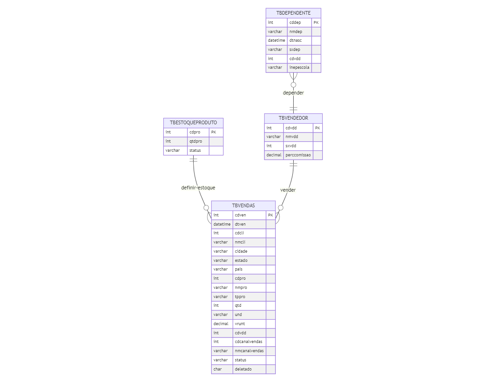

# Lista 2 de exercicios sql
*BANCO DE DADOS USADO*:


### **E8**
Apresente a query para listar o código e o nome do vendedor com maior número de vendas (contagem), e que estas vendas estejam com o status concluída.  As colunas presentes no resultado devem ser, portanto, cdvdd e nmvdd:

```sql
select TBVENDEDOR.cdvdd,
        TBVENDEDOR.nmvdd
         
from TBVENDEDOR left join TBVENDAS 
                on TBVENDEDOR.cdvdd = TBVENDAS.cdvdd
                
where TBVENDAS.status = 'Concluído'

group by TBVENDEDOR.cdvdd, TBVENDEDOR.nmvdd
order by count(TBVENDEDOR.cdvdd) desc
limit 1
```

### **E9**
Apresente a query para listar o código e nome do produto mais vendido entre as datas de 2014-02-03 até 2018-02-02, e que estas vendas estejam com o status concluída. As colunas presentes no resultado devem ser cdpro e nmpro:

```sql
select TBESTOQUEPRODUTO.cdpro, 
        TBVENDAS.nmpro
        
from TBESTOQUEPRODUTO left join TBVENDAS 
                    on TBESTOQUEPRODUTO.cdpro = TBVENDAS.cdpro
where TBVENDAS.dtven between '2014-01-03' and '2018-02-02'
        and TBVENDAS.status = 'Concluído'

group by TBESTOQUEPRODUTO.cdpro, TBVENDAS.nmpro
order by count(TBVENDAS.cdpro) desc
LIMIT 1
```
### **E10**
Com base em tais informações, calcule a comissão de todos os vendedores, considerando todas as vendas armazenadas na base de dados com status concluído.

As colunas presentes no resultado devem ser vendedor, valor_total_vendas e comissao. O valor de comissão deve ser apresentado em ordem decrescente arredondado na segunda casa decimal:

```sql
select TBVENDEDOR.nmvdd as vendedor,
       sum(TBVENDAS.vrunt * TBVENDAS.qtd) as valor_total_vendas,
       round(sum((TBVENDAS.vrunt * TBVENDAS.qtd) * TBVENDEDOR.perccomissao )  / 100, 2)  as comissao
       
from TBVENDEDOR left join TBVENDAS
                on TBVENDEDOR.cdvdd = TBVENDAS.cdvdd
                
where TBVENDAS.status = 'Concluído'
group by TBVENDEDOR.nmvdd
order by comissao desc
```
### **E11**
Apresente a query para listar o código e nome cliente com maior gasto na loja. As colunas presentes no resultado devem ser cdcli, nmcli e gasto, esta última representando o somatório das vendas (concluídas) atribuídas ao cliente:
```sql
select TBVENDAS.cdcli,
        TBVENDAS.nmcli,
        sum(TBVENDAS.qtd * TBVENDAS.vrunt) as gasto

from TBVENDAS left join TBESTOQUEPRODUTO 
                on TBVENDAS.cdcli = TBESTOQUEPRODUTO.qtdpro    
                
where TBVENDAS.status = 'Concluído'
group by TBVENDAS.cdcli, TBVENDAS.nmcli
order by gasto desc
limit 1
```

### **E12**
Apresente a query para listar código, nome e data de nascimento dos dependentes do vendedor com menor valor total bruto em vendas (não sendo zero). As colunas presentes no resultado devem ser cddep, nmdep, dtnasc e valor_total_vendas:

```sql
select TBDEPENDENTE.cddep,
        TBDEPENDENTE.nmdep,
        TBDEPENDENTE.dtnasc,
        sum(TBVENDAS.qtd * TBVENDAS.vrunt) as valor_total_vendas
        
from TBDEPENDENTE left join TBVENDEDOR 
                    on TBDEPENDENTE.cdvdd = TBVENDEDOR.cdvdd
                  left join TBVENDAS
                    on TBVENDEDOR.cdvdd = TBVENDAS.cdvdd
                
where TBVENDAS.status = 'Concluído'
group by TBDEPENDENTE.cddep, TBDEPENDENTE.nmdep, TBDEPENDENTE.dtnasc
order by valor_total_vendas 
limit 1
```
### **E13**
Apresente a query para listar os 10 produtos menos vendidos pelos canais de E-Commerce ou Matriz (Considerar apenas vendas concluídas).  As colunas presentes no resultado devem ser cdpro, nmcanalvendas, nmpro e quantidade_vendas:

```sql
select TBESTOQUEPRODUTO.cdpro,
        TBVENDAS.nmcanalvendas,
        TBVENDAS.nmpro,
        sum(TBVENDAS.qtd) as quantidade_vendas
from TBESTOQUEPRODUTO left join TBVENDAS
                        on TBESTOQUEPRODUTO.cdpro = TBVENDAS.cdpro
where TBVENDAS.status = 'Concluído' 
    and TBVENDAS.nmcanalvendas in('Ecommerce', 'Matriz')
    
group by TBESTOQUEPRODUTO.cdpro, TBVENDAS.nmcanalvendas, TBVENDAS.nmpro
order by quantidade_vendas
limit 10
```
### **E14**
Apresente a query para listar o gasto médio por estado da federação. As colunas presentes no resultado devem ser estado e gastomedio. Considere apresentar a coluna gastomedio arredondada na segunda casa decimal e ordenado de forma decrescente:

```sql
select estado,
        round(AVG(vrunt * qtd), 2) as gastomedio
from TBVENDAS 

where status = 'Concluído'

group by estado
order by gastomedio desc
```
### **E15**
Apresente a query para listar os códigos das vendas identificadas como deletadas. Apresente o resultado em ordem crescente:

```sql
select cdven
from tbvendas
where deletado = '1'
group by cdven
order by cdven
```
### **E16**
Apresente a query para listar a quantidade média vendida de cada produto agrupado por estado da federação. As colunas presentes no resultado devem ser estado e nmprod e quantidade_media. Considere arredondar o valor da coluna quantidade_media na quarta casa decimal. Ordene os resultados pelo estado (1º) e nome do produto (2º):

```sql
select estado,
        nmpro,
        round(avg(qtd), 4) as quantidade_media
        
from TBVENDAS
where status = 'Concluído'

group by estado, nmpro
order by estado, nmpro
```

